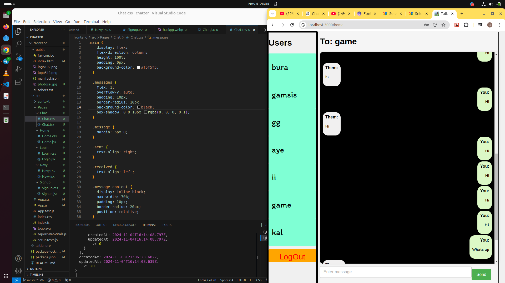

# Talkify ChatApp

  <!-- Image placed at the top -->

Welcome to **Talkify**, a modern, real-time chat application designed to make communication smooth and easy! Whether you're chatting with friends or collaborating with colleagues, Talkify offers a simple and intuitive interface for seamless messaging.

## Features

- **Real-time messaging**: Chat instantly with friends or groups without delay.
- **Responsive Design**: Works smoothly on both desktop and mobile devices.

## Installation

To run **Talkify-ChatApp** locally, follow the instructions below.

### Prerequisites

Ensure you have the following installed:

- **Node.js** (Recommended version: 14.x or higher)
- **npm** (Node Package Manager)

### Setup

1. Clone the repository:
   ```bash
   git clone https://github.com/BirukSe/Talkify-ChatApp.git
   cd Talkify-ChatApp
2. Install dependencies:

```bash
   Copy code
   npm install
    Run the application:

```bash
    Copy code
    npm start
